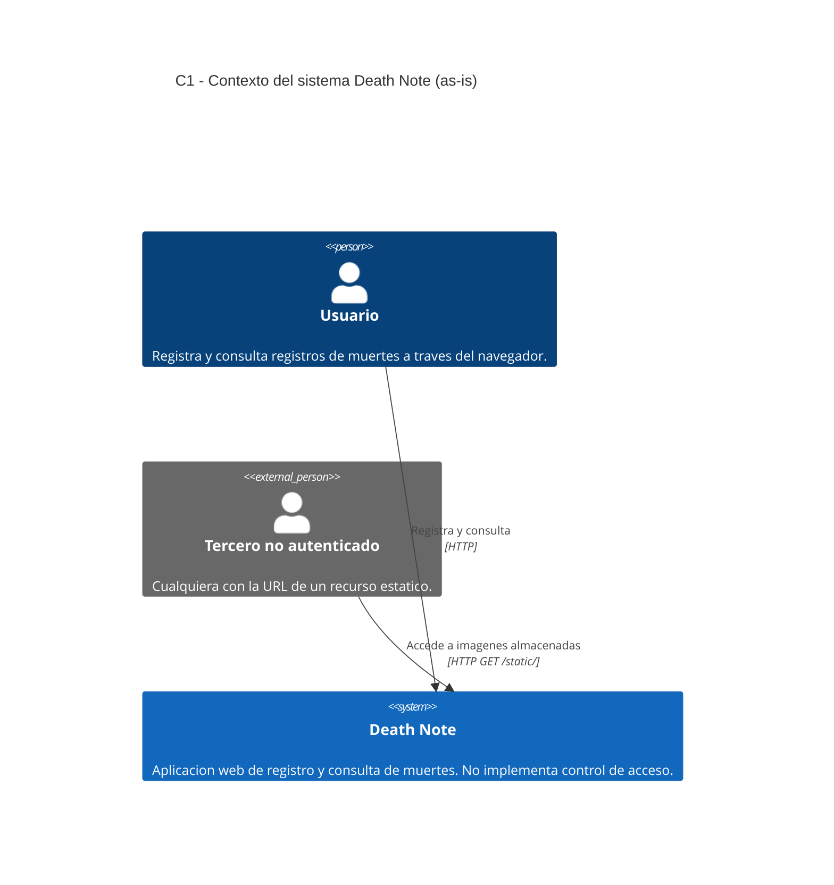

# 05 — C4 Nivel 1: Contexto (arquitectura actual, as-is)

**Sistema:** Death Note
**Repositorio:** https://github.com/frank241103/death-note-arquitectura
**Commit validado:** `d3e06e6`
**Fecha de validación contra código:** 2026-09-04

---

## 1. Propósito y audiencia de esta vista

**¿Qué pregunta responde?** Cuáles son los límites del sistema, quién interactúa
con él y de qué depende hacia afuera.

**Audiencia principal:** docente evaluador, stakeholders no técnicos, y cualquier
integrante nuevo que necesite entender el alcance antes de tocar código.

**Por qué esta vista y no otra:** el contexto es la única vista que permite
discutir el alcance sin entrar en tecnología. Se eligió como punto de partida
porque el sistema fue *adoptado*, no construido por el equipo, y era necesario
delimitar qué se estaba analizando antes de descomponerlo.

---

## 2. Diagrama C1 — Contexto

---

## 3. Actores

| Actor | Tipo | Interacción | Evidencia en el código |
|---|---|---|---|
| Usuario | Persona | Registra y consulta muertes vía frontend | `front/src/pages/death-note-list/dn-list.tsx`, `front/src/pages/kill-register/kill-register.tsx` |
| Tercero no autenticado | Persona externa | Accede a imágenes sin credenciales | `back/server/router.go`: `router.PathPrefix("/static/")` sin middleware de autorización |

---

## 4. Límites del sistema

El sistema Death Note es **autocontenido**. No consume servicios externos, no
publica eventos, y no se integra con terceros.

**Comprobación:** no existen llamadas HTTP salientes en el backend. Las
dependencias declaradas en `back/go.mod` son librerías (gorilla/mux, GORM,
godotenv, rs/cors, drivers de base de datos), no clientes de servicios remotos.

---

## 5. Correcciones realizadas tras validar contra el código.

La versión inicial de esta vista, elaborada antes de auditar el código, incluía
dos elementos que **no existen en el sistema**. Ambos fueron eliminados.

| Elemento inicial | Estado | Evidencia que motivó el cambio |
|---|---|---|
| "Servicio de autenticación externo" | **Eliminado** | No existe middleware de autenticación en `back/server/router.go`. Las cuatro rutas se registran sin verificación de identidad. No hay dependencia de Keycloak, OAuth ni equivalente en `go.mod` |
| "APIs externas consumidas por el sistema" | **Eliminado** | No hay clientes HTTP salientes en el backend |
| "Motor de base de datos relacional o no relacional" | **Corregido** | La configuración efectiva es SQLite (`back/config/config.json`: `"database": "sqlite"`). La base no es un sistema externo: es un archivo local, por lo que se modela como contenedor en el nivel C2, no como sistema externo en C1 |
| Actor "Tercero no autenticado" | **Agregado** | La ruta `/static/` sirve `uploads/` mediante `http.FileServer` sin control de acceso. El actor existe porque el sistema efectivamente lo atiende |

**Nota sobre el actor agregado.** Su inclusión no es una advertencia de
seguridad disfrazada de diagrama: es un actor real que el sistema atiende hoy.
Omitirlo haría que el diagrama describiera un sistema distinto al que existe.
