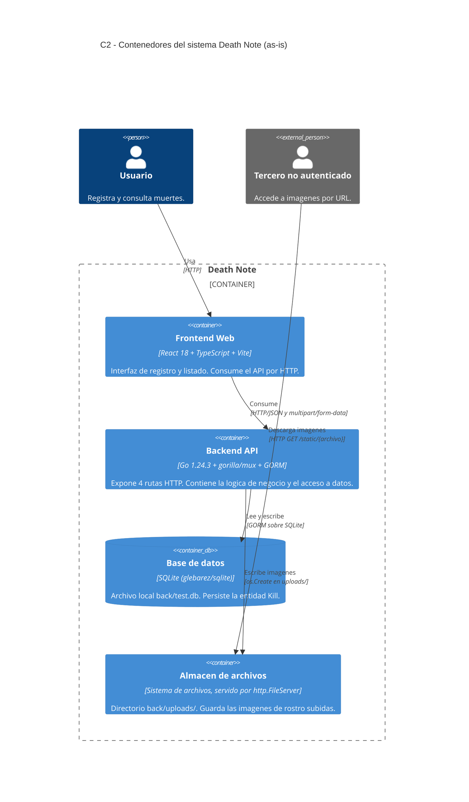

# 06 — C4 Nivel 2: Contenedores (arquitectura actual, as-is)

**Sistema:** Death Note
**Commit validado:** `d3e06e6`
**Fecha de validación contra código:** 2026-09-04

---

## 1. Propósito y audiencia de esta vista

**¿Qué pregunta responde?** Qué unidades ejecutables componen el sistema, con
qué tecnología está construida cada una y cómo se comunican entre sí.

**Audiencia principal:** desarrolladores del equipo y responsables de
despliegue. Es la vista que se usa para decidir dónde implementar un cambio y
para entender qué se despliega por separado.

**Por qué esta vista:** el sistema tiene procesos con ciclos de vida
independientes (frontend, backend, persistencia). Sin esta vista no es posible
explicar por qué la latencia medida en el nivel de rendimiento se concentra en
un solo salto de comunicación.

---

## 2. Diagrama C2 — Contenedores

---

## 3. Contenedores y responsabilidades

### C2-1 · Frontend Web
- **Tecnología:** React + TypeScript, empaquetado con Vite. Node 24.18.0.
- **Responsabilidad:** presentar el listado de registros y el formulario de creación.
- **Ancla en el código:** `front/`, vistas en `front/src/pages/`.
- **Comunicación:** peticiones HTTP al backend. La URL base se configura por variable de entorno `FRONT_BACKEND`.

### C2-2 · Backend API
- **Tecnología:** Go 1.24.3, router `gorilla/mux`, ORM `GORM`, CORS con `rs/cors`.
- **Responsabilidad:** exponer el API, aplicar la lógica de negocio y coordinar la persistencia.
- **Ancla en el código:** `back/main.go`, `back/server/server.go`, `back/server/router.go`.
- **Rutas expuestas** (`back/server/router.go`):

| Método | Ruta | Handler |
|---|---|---|
| GET, POST | `/death` | `HandleKills` |
| GET | `/death/{id}` | `HandleKillsWithId` |
| PATCH | `/deathUpdate/{id}` | `handleUpdate` |
| GET | `/static/*` | `http.FileServer` |

### C2-3 · Base de datos
- **Tecnología:** SQLite mediante el driver `glebarez/sqlite` (implementación en Go puro, sin CGO).
- **Responsabilidad:** persistir la entidad `Kill`.
- **Ancla en el código:** `back/server/server.go`, función `initDB()`, caso `"sqlite"`: `gorm.Open(sqlite.Open("test.db"))`.
- **Observación arquitectónica:** el motor **no está fijado en el diseño**. `back/config/config.json` lo selecciona en tiempo de arranque entre `sqlite` y `postgres`, y ambas ramas están implementadas. La configuración vigente es `sqlite`.

### C2-4 · Almacén de archivos
- **Tecnología:** sistema de archivos local, servido por `http.FileServer`.
- **Responsabilidad:** almacenar las imágenes de rostro asociadas a cada registro.
- **Ancla en el código:** escritura en `back/server/kill_handlers.go` (`os.MkdirAll("uploads", ...)`, `os.Create(savePath)`); lectura en `back/server/router.go` (`http.Dir("uploads/")`).
- **Por qué se modela como contenedor independiente:** tiene una vía de acceso propia (`/static/`), un ciclo de vida propio (está excluido del control de versiones por `.gitignore`) y un perfil de acceso distinto al del API, ya que se sirve sin ninguna verificación. Modelarlo dentro del backend ocultaría esas tres diferencias.

---

## 4. Comunicación entre contenedores

| Origen | Destino | Protocolo | Evidencia |
|---|---|---|---|
| Frontend | Backend | HTTP/JSON en lectura, `multipart/form-data` en creación | `back/server/kill_handlers.go`: `r.ParseMultipartForm(10 << 20)` en creación; `json.NewDecoder` en actualización |
| Backend | Base de datos | GORM | `back/server/server.go`: `gorm.Open(...)`, `s.DB.AutoMigrate(&models.Kill{})` |
| Backend | Almacén de archivos | Escritura directa en disco | `back/server/kill_handlers.go`: `os.Create(savePath)` |
| Navegador | Almacén de archivos | HTTP directo, sin pasar por la lógica del API | `back/server/router.go`: `http.StripPrefix("/static/", http.FileServer(...))` |

**Observación relevante para el rendimiento.** La relación Frontend → Backend
transporta la colección completa de registros en cada consulta del listado: el
endpoint no pagina. En la medición de línea base, cada respuesta pesó 557 KB con
3.302 registros. Esta característica se explica en el nivel C3.

---

## 5. Correcciones realizadas tras validar contra el código

| Elemento inicial | Estado | Evidencia que motivó el cambio |
|---|---|---|
| Modelo de tres contenedores (frontend, backend, base de datos) | **Corregido** | Se agregó el almacén de archivos como cuarto contenedor, por su vía de acceso y ciclo de vida propios |
| "Base de datos PostgreSQL" | **Corregido** | `back/config/config.json` declara `"database": "sqlite"`. PostgreSQL existe como rama alterna en el código pero no es la configuración vigente |
| "Servicio de autenticación (Keycloak)" | **Eliminado** | No existe en el código ni en las dependencias |
| Relación "Backend → API externa" | **Eliminado** | No hay clientes HTTP salientes en el backend |
