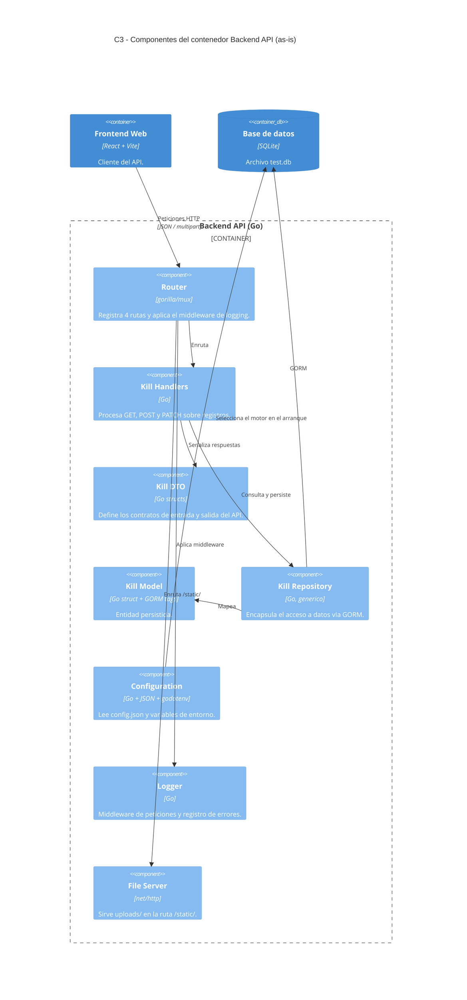

# 07 — C4 Nivel 3: Componentes y tabla de trazado

**Sistema:** Death Note
**Contenedor descompuesto:** Backend API
**Commit validado:** `d3e06e6`
**Fecha de validación contra código:** 2026-09-04

---

## 1. Propósito y audiencia de esta vista

**¿Qué pregunta responde?** Cómo está organizado internamente el contenedor más
crítico del sistema y qué pieza es responsable de cada paso del procesamiento
de una petición.

**Audiencia principal:** desarrolladores que van a modificar el backend. Es la
vista que se usa para asignar una tarea a un archivo concreto.

**Por qué se descompuso el Backend API y no otro contenedor:** concentra la
totalidad de la lógica de negocio, la persistencia y las cuatro rutas expuestas.
Además, es donde reside la causa del incumplimiento del umbral de rendimiento
medido en el Módulo 2.

---

## 2. Diagrama C3 — Componentes del Backend API

---

## 3. Componentes y responsabilidades

| Componente | Responsabilidad declarada |
|---|---|
| Router | Registrar las rutas y despachar cada petición al handler correspondiente |
| Kill Handlers | Interpretar la petición, invocar el repositorio y construir la respuesta |
| Kill DTO | Definir las estructuras de entrada y salida del API |
| Kill Model | Representar la entidad persistida y su mapeo a tabla |
| Kill Repository | Aislar el acceso a datos del resto de la lógica |
| Configuration | Determinar el motor de persistencia y cargar variables de entorno |
| Logger | Registrar peticiones atendidas y errores |
| File Server | Entregar los archivos del directorio `uploads/` |

---

## 4. Hallazgos de la validación contra el código

### 4.1 Contrato declarado ≠ contrato implementado
`api/kill.go` declara `KillRequestDto` con etiquetas `json:"..."`, lo que sugiere
un contrato uniforme en JSON. La implementación no lo respeta:

- `handleCreateKill` exige `multipart/form-data` y lee con `r.FormValue()`.
- `HandleUpdateKillById` sí decodifica JSON con `json.NewDecoder`.

Dos operaciones sobre el mismo recurso usan formatos distintos, y el DTO
documenta solo uno. **Comprobado empíricamente:** una petición JSON a
`POST /death` responde `formato inválido: request Content-Type isn't multipart/form-data`.

### 4.2 El componente Configuration acopla el arranque a un artefacto no versionado
`initDB()` invoca `godotenv.Load()` y aborta con `Fatal` si el archivo `.env` no
existe, **antes** de evaluar qué motor está configurado. Con SQLite ninguna
variable de PostgreSQL se utiliza, pero el archivo sigue siendo obligatorio.
Como `.env` está excluido por `.gitignore`, un clon limpio no arranca.

### 4.3 Ausencia de paginación en el listado
`handleGetAllKills` invoca `s.KillRepository.FindAll()`, recorre la totalidad de
los resultados y los serializa completos. No recibe ni aplica parámetros de
límite o desplazamiento.

**Consecuencia medida:** con 3.302 registros, cada respuesta pesa 557 KB. En una
corrida de 60 segundos con 50 usuarios virtuales se transfirieron 1,3 GB. El
p95 resultante fue de 1114,69 ms contra un umbral prerregistrado de 500 ms.

### 4.4 Mensaje de error inconsistente con el modelo
Cuando falta `fullName`, `handleCreateKill` responde *"firstName y lastName son
requeridos"* — campos que no existen en `KillRequestDto` ni en el modelo.

---

## 5. Tabla completa de trazado C4

| ID | Nivel C4 | Elemento C4 | Responsabilidad | Archivo / módulo real | Clase, símbolo o configuración verificable | Relación verificada | Estado | Observación / corrección |
|---|---|---|---|---|---|---|---|---|
| T-01 | C1 | Usuario | Registra y consulta muertes | `front/src/pages/` | `dn-list.tsx`, `kill-register.tsx` | Usuario → Frontend (HTTP) | Verificado | — |
| T-02 | C1 | Tercero no autenticado | Accede a imágenes sin credenciales | `back/server/router.go` | `router.PathPrefix("/static/")` sin middleware | Tercero → Almacén de archivos | **Corregido** | Actor agregado tras la auditoría: el sistema lo atiende hoy |
| T-03 | C1 | Servicio de autenticación externo | Validación de accesos | — | — | — | **Eliminado** | No existe. Ninguna ruta aplica autenticación; sin dependencia de auth en `go.mod` |
| T-04 | C1 | APIs externas | Integraciones de terceros | — | — | — | **Eliminado** | No hay clientes HTTP salientes en el backend |
| T-05 | C2 | Frontend Web | Capa de presentación | `front/` | `package.json`, Vite, React + TS | Frontend → Backend (HTTP) | Verificado | — |
| T-06 | C2 | Backend API | Lógica de negocio y API HTTP | `back/main.go`, `back/server/server.go` | `func (s *Server) StartServer()`, `srv.ListenAndServe()` | Backend → BD (GORM) | Verificado | — |
| T-07 | C2 | Base de datos | Persistencia de la entidad Kill | `back/server/server.go` | `case "sqlite": gorm.Open(sqlite.Open("test.db"))` | Backend → SQLite | **Corregido** | El modelo inicial declaraba PostgreSQL; `config.json` declara `sqlite` |
| T-08 | C2 | Almacén de archivos | Guarda las imágenes subidas | `back/server/kill_handlers.go`, `back/server/router.go` | `os.Create(savePath)`; `http.Dir("uploads/")` | Backend → disco; Navegador → `/static/` | **Corregido** | Contenedor agregado tras la auditoría; no figuraba en el modelo inicial |
| T-09 | C3 | Router | Registro y despacho de rutas | `back/server/router.go` | `mux.NewRouter()`, 4 `HandleFunc` | Router → Handlers | Verificado | — |
| T-10 | C3 | Kill Handlers | Procesa las peticiones sobre registros | `back/server/kill_handlers.go` | `HandleKills`, `handleGetAllKills`, `handleCreateKill`, `HandleUpdateKillById` | Handlers → Repository | Verificado | Sin paginación en `handleGetAllKills` |
| T-11 | C3 | Kill DTO | Contratos de entrada y salida | `back/api/kill.go` | `KillRequestDto`, `KillResponseDto` | Handlers → DTO | Verificado | Declara `json:` pero la creación usa `multipart/form-data` |
| T-12 | C3 | Kill Model | Entidad persistida | `back/models/kill.go` | `models.Kill`, `ToKillResponseDto()` | Repository → Model | Verificado | — |
| T-13 | C3 | Kill Repository | Acceso a datos | `back/repository/kill_repository.go` | `repository.NewKillRepository(db)`, `FindAll`, `FindById`, `Save`, `Update` | Repository → GORM → SQLite | Verificado | — |
| T-14 | C3 | Configuration | Configuración de arranque | `back/config/config.json`, `back/server/server.go` | `json.Unmarshal(configFile, &config)`, `godotenv.Load()` | Configuration → selección de motor | Verificado | Aborta si falta `.env`, aun usando SQLite |
| T-15 | C3 | Logger | Registro de peticiones y errores | `back/logger/` | `logger.NewLogger()`, `s.logger.RequestLogger` | Router → Logger (middleware) | Verificado | — |
| T-16 | C3 | File Server | Entrega de archivos estáticos | `back/server/router.go` | `http.StripPrefix("/static/", http.FileServer(http.Dir("uploads/")))` | Router → File Server | Verificado | Sin control de acceso |
| T-17 | C3 | Middleware de autorización | Control de acceso a rutas | — | — | — | **Eliminado** | No existe en el sistema. Se había representado por analogía con arquitecturas típicas |
| T-18 | C3 | Capa de servicios de aplicación | Orquestación de casos de uso | — | — | — | **Eliminado** | No existe una capa intermedia: los handlers invocan directamente el repositorio |

---

## 6. Registro de correcciones producidas por la auditoría

| Elemento | Acción | Evidencia que motivó el cambio |
|---|---|---|
| Servicio de autenticación externo (C1) | Eliminado | Ninguna de las cuatro rutas aplica verificación de identidad |
| APIs externas (C1) | Eliminado | No hay clientes HTTP salientes |
| Tercero no autenticado (C1) | Agregado | `/static/` sirve `uploads/` sin control de acceso |
| Base de datos PostgreSQL (C2) | Corregido a SQLite | `config.json` declara `"database": "sqlite"` |
| Almacén de archivos (C2) | Agregado | Vía de acceso, ciclo de vida y perfil de acceso propios |
| Middleware de autorización (C3) | Eliminado | Sin evidencia en el router |
| Capa de servicios de aplicación (C3) | Eliminado | Los handlers acceden directamente al repositorio |

**Criterio aplicado.** Todo elemento que no pudo señalarse en un archivo,
símbolo o configuración concreta fue eliminado del modelo, aunque
arquitectónicamente tuviera sentido. Un elemento que "debería existir" no se
representa como hecho verificado.

---

## 7. Declaración de uso de IA en este módulo

| Sugerencia de la IA | Veredicto del equipo | Justificación |
|---|---|---|
| Representar un servicio de autenticación en el C1 | **Falsa** — rechazada | Sugerida por analogía con arquitecturas web típicas; el código no la respalda |
| Representar una capa de servicios entre handlers y repositorio | **Falsa** — rechazada | No existe en el código |
| Modelar `uploads/` como contenedor independiente | **Válida** — aceptada | Verificada en `router.go` y `kill_handlers.go` |
| Incluir el actor "tercero no autenticado" | **Válida** — aceptada | Verificada por comportamiento observable de `/static/` |
| Enumerar todas las clases del backend | **Irrelevante** — rechazada | El enunciado pide elementos arquitectónicamente relevantes, no un inventario |

---

## 8. Trazabilidad de la entrega en Git

- **Repositorio:** https://github.com/frank241103/death-note-arquitectura
- **Rama:** `main`
- **Commit:** *06b8d27*
- **Pull Request:** *#4*
