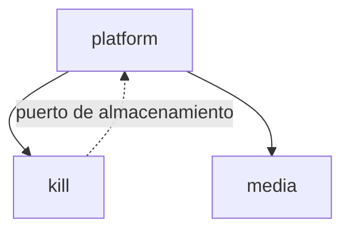

# 12 — Mapa modular y límites de dependencia

**Sistema:** Death Note  
**Contenedor analizado:** Backend API  
**Módulo académico:** 4  
**Fecha de validación contra código:** 2026-10-09

---

## 1. Módulos propuestos

Los ocho componentes identificados en `docs/07-c4-componentes.md` se agrupan
en tres módulos de dominio. La agrupación conserva un único despliegue, pero
hace explícito qué responsabilidad pertenece a cada frontera.

| Módulo | Componentes del C3 que agrupa | Responsabilidad única | No es responsable de |
|---|---|---|---|
| `kill` | Kill Handlers, Kill DTO, Kill Model y Kill Repository | Gestionar el ciclo de vida de los registros de muerte: recibir operaciones, aplicar sus reglas y persistir o consultar los datos | Guardar o servir archivos físicos; iniciar el servidor; configurar CORS, logging o routing |
| `media` | File Server y la operación de almacenamiento de imágenes que actualmente está incrustada en Kill Handlers | Guardar, localizar y servir archivos de imagen mediante una interfaz estable | Aplicar reglas de `Kill`, acceder al repositorio de muertes o decidir cómo arranca la aplicación |
| `platform` | Router, Configuration y Logger | Arrancar y conectar el sistema: cargar configuración, componer dependencias, registrar rutas y aplicar capacidades transversales | Implementar reglas de negocio, persistir registros de muerte o escribir directamente archivos de imagen |

La propuesta separa **qué hace el sistema** (`kill`), **cómo conserva y expone
archivos** (`media`) y **cómo se inicia y conecta el conjunto** (`platform`).

### Alcance del análisis

El mapa corresponde al backend implementado en Go. Se revisaron los paquetes
internos, sus importaciones y los puntos donde se mezclan responsabilidades. No
se propone dividir el sistema en microservicios: los límites se aplicarán dentro
del mismo despliegue como un monolito modular.

## 2. Matriz de dependencias permitidas

La fila representa el módulo que importa o usa; la columna representa el
módulo usado.

|  | puede usar `kill` | puede usar `media` | puede usar `platform` |
|---|:---:|:---:|:---:|
| **`kill`** | — | **No** | **No** |
| **`media`** | **No** | — | **No** |
| **`platform`** | **Sí** | **Sí** | — |

### Justificación de los límites

- **`kill` no puede usar `media`:** las reglas del registro de muerte no deben
  conocer `os.Create`, el directorio `uploads/` ni otra implementación de
  almacenamiento. Si necesita guardar una imagen, debe hacerlo a través de un
  puerto definido desde su propia frontera y recibido por inyección.
- **`kill` no puede usar `platform`:** el dominio no debe depender del router,
  del logger, de CORS ni del proceso de arranque. Esto permite probar sus reglas
  sin levantar un servidor HTTP.
- **`media` no puede usar `kill`:** guardar y servir un archivo es una capacidad
  independiente. El módulo de archivos no necesita conocer `models.Kill`, sus
  DTO ni su repositorio.
- **`media` no puede usar `platform`:** la ubicación del almacenamiento y las
  dependencias transversales deben entregarse desde el punto de composición;
  `media` no debe leer la configuración global ni registrar rutas por sí mismo.

`platform` sí puede usar `kill` y `media` porque actúa como punto de composición:
crea las implementaciones, las conecta y expone los endpoints. Esta dependencia
debe ir desde el exterior hacia los módulos, nunca en sentido contrario.

### Dirección esperada



La línea punteada representa un contrato definido por `kill` e implementado
desde el exterior. No significa que `kill` importe directamente a `platform`.

## 3. Acoplamiento actual medido

Se ejecutó en la carpeta `back/` el comando solicitado:

```text
go list -deps ./... | findstr backend-avanzada
```

En Linux o macOS se puede reproducir la misma comprobación con:

```text
go list -deps ./... | grep backend-avanzada
```

La salida de paquetes internos fue:

```text
backend-avanzada/api
backend-avanzada/config
backend-avanzada/logger
backend-avanzada/models
backend-avanzada/repository
backend-avanzada/server
backend-avanzada
```

La lectura de los imports confirma estas relaciones internas:

| Paquete actual | Dependencia interna observada | Lectura frente a la matriz |
|---|---|---|
| `models` | `api` | Relación interna de `kill`; permitida dentro del módulo propuesto |
| `repository` | `models` | Relación interna de `kill`; permitida dentro del módulo propuesto |
| `server` | `api`, `models`, `repository` | `platform` usa `kill`; dirección permitida |
| `server` | `config`, `logger` | Responsabilidades de `platform` reunidas en el mismo paquete |
| raíz `backend-avanzada` | `server` | El ejecutable delega el arranque a `platform`; permitido |

No existe un paquete `backend-avanzada/media`. Por eso la salida de
`go list -deps` no muestra una dependencia hacia ese módulo. Esto no significa
que la responsabilidad de archivos esté desacoplada: el código de
almacenamiento y entrega está incrustado dentro del paquete `server`. En
consecuencia, el análisis de imports no puede detectar la dependencia entre
`kill` y el sistema de archivos porque ambas responsabilidades comparten el
mismo paquete.

El hallazgo es que el límite modular de `media` todavía no existe físicamente.
El handler de creación conoce directamente la implementación local de archivos,
lo que viola la regla propuesta `kill` → `media`: **No**.

## 4. Cohesión

### Módulo `kill`

Los DTO, el modelo, el repositorio y los handlers se relacionan con el mismo
concepto de negocio: el registro de una muerte. Su cohesión conceptual es alta,
aunque el handler de creación pierde esa cohesión cuando también crea
directorios, construye rutas públicas y copia archivos.

### Módulo `media`

La responsabilidad propuesta es cohesiva porque todas sus operaciones deberían
cambiar cuando cambie la estrategia de almacenamiento o entrega de imágenes.
En el código actual no está encapsulada: la escritura vive en
`kill_handlers.go` y la entrega HTTP en `router.go`. Un cambio de disco local a
otro almacenamiento obligaría a modificar más de una responsabilidad.

### Módulo `platform`

El paquete actual `server/` presenta baja cohesión porque mezcla cuatro razones
distintas para cambiar:

1. el arranque del servidor HTTP (`server.go:45-67`);
2. la configuración y apertura de la base de datos (`server.go:69-99`);
3. la configuración de CORS (`server.go:51-56`);
4. el routing (`router.go:9-16`).

Un ajuste en cualquiera de esos aspectos obliga a tocar el mismo paquete. La
frontera `platform` debe conservar la composición, pero separar internamente el
arranque, la infraestructura de base de datos, CORS y el registro de rutas.

## 5. Violaciones detectadas

> **V-01** — `back/server/kill_handlers.go:102-121` — el handler de creación de
> `Kill` crea el directorio `uploads/`, construye una ruta física, abre el
> archivo con `os.Create` y copia su contenido. Esto hace que la lógica de
> `kill` dependa directamente de la implementación de almacenamiento, aunque la
> matriz establece que `kill` no puede usar `media`. Importa porque cambiar el
> almacenamiento obliga a modificar el caso de uso y dificulta probarlo sin
> acceso al sistema de archivos.

> **V-02** — `back/server/router.go:15` — el router conoce el directorio físico
> `uploads/` y configura directamente `http.FileServer`. Aunque `platform` puede
> usar `media`, debería hacerlo mediante la interfaz pública del módulo y no
> conocer su implementación local. La ausencia de esa frontera dispersa el
> cambio entre el router y el handler.

### Prioridad de tratamiento

| Violación | Prioridad | Acción inicial | Evidencia de cierre |
|---|---|---|---|
| V-01 | Alta | Extraer un puerto de almacenamiento y retirar `os.Create` del handler | Prueba del caso de uso con almacenamiento simulado |
| V-02 | Media | Encapsular el servicio de archivos detrás del módulo `media` | El router registra una interfaz pública sin conocer `uploads/` |
